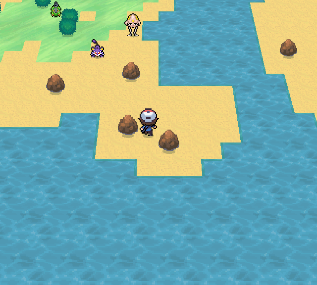
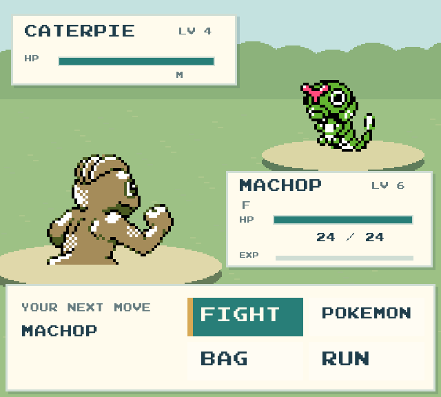
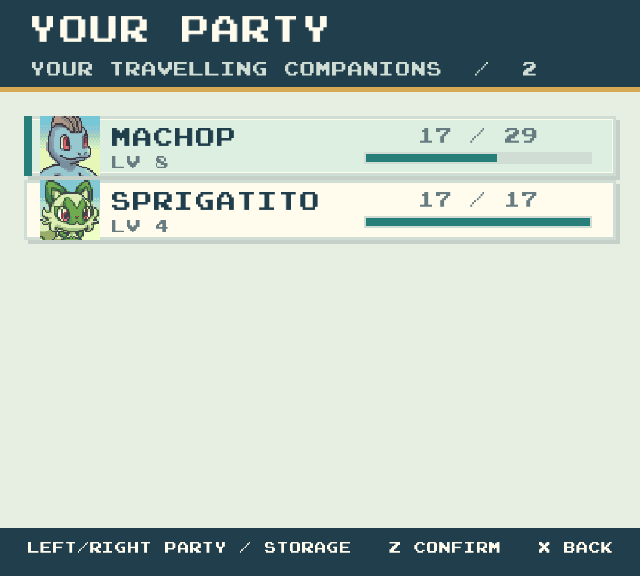
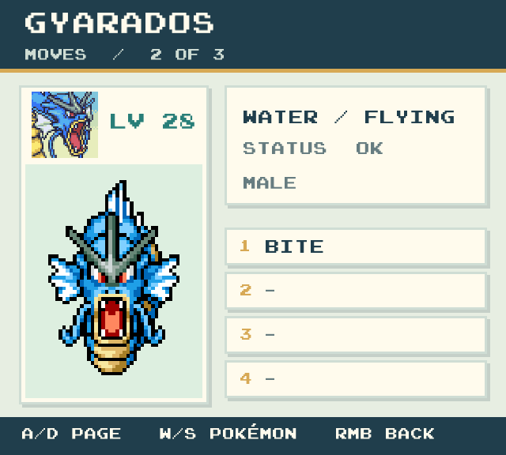
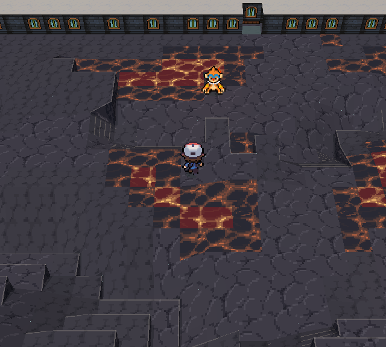
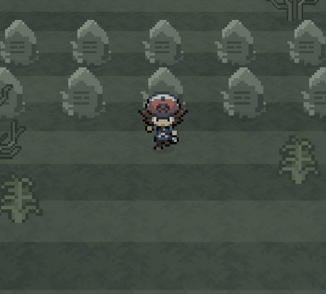
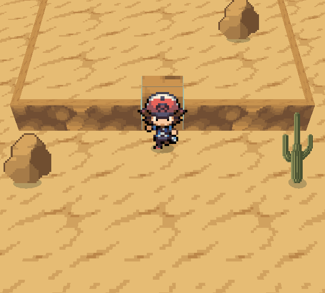
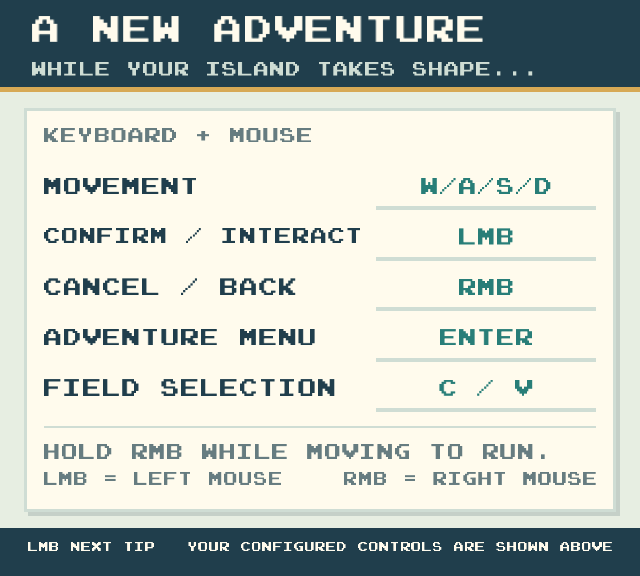

# PokeWilds 2.5D — biomi, interfaccia e rilievi

Una ricostruzione PC di PokeWilds 0.8.11 in Java/LibGDX, con mondo prospettico, sprite animati [PMDCollab](https://sprites.pmdcollab.org/) e allenatori di Pokémon Black / White. Il rework recuperato usa un atlante ambientale Stardew di 218 regioni e sei animazioni, pannelli ispirati a FireRed/LeafGreen, arredi completi e mosse con effetti estesi al viewport. I Pokémon PMD e il sistema di rilievi vengono conservati. Fonti, trasformazioni e limiti di distribuzione sono registrati in [ASSET-RIGHTS.md](docs/ASSET-RIGHTS.md).

La versione aggiunge **552 specie giocabili** alle 410 della base, per **962 specie totali**, una caldera vulcanica e rampe percorribili tra alcune terrazze montane. La mappa resta procedurale: il nuovo passaggio di generazione modifica davvero terreno e collisioni. La presentazione predefinita usa sprite 2D e la build normale esclude i modelli GLB. È una versione Windows PC x64, non un port Nintendo 3DS.

Build locale verificata: **v0.8.11-stardew.1**, tag sul commit `9066b067`; `main` include anche la regressione del resize durante le mosse, senza cambiare il JAR consegnato. Stato, hash dello ZIP, prossimo comando e prove: [REWORK-STATUS.md](docs/REWORK-STATUS.md), [REWORK-TESTS.md](docs/REWORK-TESTS.md), [copertura materiali](docs/ASSET-COVERAGE.md). Le anteprime seguenti sono storiche; gli screenshot del nuovo JAR sono negli artifact di verifica e nella consegna della build.

















Il ramo **`main`** riunisce le correzioni di johto.3 con **14 profili di bioma**, rilievi ricostruiti dai dirupi reali, nebbia del cimitero, materiali vulcanici e desertici dedicati, regole di habitat per i nuovi incontri e un layout uniforme per i menu. Conserva WASD/mouse, il Pokémon intero animato nelle informazioni e la continuità della vista durante abilità e battaglie. Integra le pose diagonali PMD e il campionamento configurabile degli asset senza sostituire le alture v5. [REWORK-TESTS.md](docs/REWORK-TESTS.md) identifica le verifiche correnti; [VERIFICA.txt](VERIFICA.txt) e [AGGIORNAMENTO-BIOMI.txt](AGGIORNAMENTO-BIOMI.txt) conservano la documentazione delle iterazioni precedenti.

## Giocare su Windows

Nel nuovo pacchetto Windows estratto apri **`GIOCA.cmd`** oppure **`run-johto.cmd`**: non serve `build.cmd`. In quella cartella Java 17 e il JAR compilato sono già inclusi. Mantieni insieme launcher, `dist/` e `toolchain/`; non spostare soltanto il file di avvio.

Il pacchetto Stardew viene assemblato e verificato da [tools/package_windows.py](tools/package_windows.py) e [tools/verify_windows_package.py](tools/verify_windows_package.py), con runtime incluso e ricevuta legata all’hash dello ZIP. La pubblicazione automatica degli asset di riferimento non è attiva; la consegna locale è distinta dai sorgenti.

Il pacchetto Windows della [release privata v0.8.11-johto.3](https://github.com/ZeriFox/pokewilds-2.5d/releases/tag/v0.8.11-johto.3) resta la **versione binaria precedente**: richiede un account con accesso e non comprende tutta questa integrazione di `main`. L'aggiornamento del codice non crea una nuova release binaria.

**Il clone Git e Code → Download ZIP contengono sorgenti e risorse, senza JAR compilato o Java incluso.** Per avviarli occorre seguire la sezione «Ricompilare dai sorgenti»; non equivalgono alla cartella locale completa o al pacchetto Windows della release.

Comandi: **WASD** per muoversi e navigare, **clic sinistro (LMB)** per confermare/interagire, **clic destro (RMB)** per tornare indietro; mantieni il destro premuto mentre cammini per correre. **Invio** apre il menu, **C/V** cambia la selezione sul campo, **F11** attiva lo schermo intero. Nei campi nome WASD digita lettere: usa le frecce su/giù per cambiare campo e Invio per confermare un soprannome. Il gamepad conserva i comandi precedenti. Salvataggi e impostazioni sono in `run-johto/`. `run-johto-sprites.cmd` avvia la stessa presentazione. `run.cmd` usa la grafica classica e una cartella `run/` separata; la scelta grafica non disattiva il Pokédex ampliato o la nuova generazione.

Il preset completo originale frecce/Z/X viene migrato una volta a WASD/mouse in `settings.txt`. Le configurazioni personalizzate vengono conservate; `MouseLeft` e `MouseRight` sono i nomi dei due binding nei file di impostazioni. Gli aiuti a schermo seguono i binding attivi.

## Contenuto e limiti

- **Mondo:** 218 regioni e 6 sequenze animate nell'atlante attivo `visual/stardew`; `visual/unova` fornisce gli avatar e `visual/custom` mantiene la priorità esplicita degli override; 14 profili assegnano terreno, pareti, altezze visive, fluidi, decorazioni, atmosfera, habitat e transizioni. Deserto, vulcano e cimitero hanno materiali dedicati. Il fantasma notturno è un incontro originale legittimo, ora rappresentato da un'apparizione moderna; un asset mancante non genera un fantasma sostitutivo.
- **Interfaccia e lotte:** layout a righe e colonne, comandi e tutorial con binding effettivi, quantità separate dai nomi e testo adattato agli spazi; portrait PMD e Pokémon intero animato su tutte e tre le pagine del riepilogo. Le arene riutilizzano i materiali del bioma; panorama e transizioni coprono la finestra.
- **Habitat:** i nuovi incontri considerano ambiente, acqua effettiva, prossimità dell'acqua, profondità geometrica, orario e pesi di rarità. Milotic resta nell'acqua dell'oasi; gli acquatici selvatici coperti dalle regole non possono passeggiare sulla sabbia. I Pokémon posseduti conservano i loro controlli.
- **Pokédex:** 552 aggiunte con dati e grida da versioni registrate. Sono usate soltanto mosse già implementate; condizioni evolutive non supportate sono escluse. Non tutte le forme alternative o varianti shiny hanno artwork esatto. Dettagli in [POKEDEX-ESPANSO.txt](POKEDEX-ESPANSO.txt).
- **Generazione:** EMBER CALDERA contiene lava realmente solida, sentieri e rocce; alcune pareti montane ricevono rampe reali. Il passaggio riguarda nuove isole e nuove aree oltre i bordi; non riscrive i terreni dei salvataggi caricati. Il formato dei salvataggi resta originale. Dettagli in [GENERAZIONE-MODERNA.txt](GENERAZIONE-MODERNA.txt).

La **revisione v5 dei rilievi** costruisce piani superiori realmente rialzati. `WorldElevation` ricava le quote dai vincoli dei dirupi e delle rampe salvati; gli angoli condivisi raccordano i passaggi aperti. Terreno, piedi degli attori e camera leggono la stessa superficie. Le pareti uniscono soltanto quote diverse: quando i due lati hanno la stessa altezza non compare un muretto aggiuntivo. Bordi sottili, ombre di contatto e luce sulla pendenza rendono leggibili le terrazze; i segni delle rampe seguono l'inclinazione effettiva.

La cache delle quote segue una firma strutturale dei bordi: un cambio di marea o di sola texture non ricostruisce il rilievo. La correzione visiva vale anche sui mondi già caricati, senza nuove altezze persistenti, modifiche alle collisioni o migrazioni dei salvataggi. Non teletrasporta o elimina i Pokémon salvati. L'integrazione con johto.3 conserva questo sistema di quote; i precedenti dirupi decorativi non lo sostituiscono. Le modifiche a generazione e habitat restano documentate separatamente.

Il campionamento degli asset separa i pixel sorgente dalle celle di 16 unità del mondo; i metadati possono specificare campioni, dimensioni visive, ancore e scostamenti senza cambiare collisioni o tile salvati. In lotta i Pokémon usano vere pose PMD diagonali, verso nord-est per l'alleato e sud-ovest per l'avversario, con gli stessi ingombri per disegno e apparizione. Restano la scala uniforme, i piedi ancorati e gli effetti originali. Il layout UI continua a scalare uniformemente con la finestra.

Maree guadabili e pozzanghere lasciano visibile il fondale. I sentieri della mansion ricevono materiali coerenti con l'ambiente vicino anche quando la route originale indica neve: questa correzione riguarda la presentazione e conserva route e incontri.

Le celle solide non classificate mantengono un ostacolo coerente; i marker ignoti non producono sprite segnaposto. La vista 2.5D resta attiva durante mosse sul campo, costruzione, pesca e riposo. Alcuni effetti e segnali di stato conservano risorse originali; i fallback PMD mancanti sono documentati. Le prove UI confrontano risoluzioni equivalenti al 100/125/150%, rapporti estremi e dimensioni del desktop: non certificano ogni impostazione DPI hardware. I test non dimostrano equivalenza completa delle meccaniche e non coprono ogni incontro o configurazione multigiocatore.

## Ricompilare dai sorgenti

Servono **Python 3.10+**, **JDK 17** e accesso al repository. Configura `JAVA_HOME` oppure rendi `java`, `javac` e `jar` disponibili nel `PATH`.

```powershell
git clone https://github.com/ZeriFox/pokewilds-2.5d.git
cd pokewilds-2.5d
```

Scarica **`pokewilds-2.5d-build-inputs.zip`** dalla [release johto.2](https://github.com/ZeriFox/pokewilds-2.5d/releases/tag/v0.8.11-johto.2) con il browser autenticato. Estrailo **nella root del clone**, accanto a `build.py`. Contiene soltanto le due dipendenze binarie:

```text
pokewilds-2.5d/
  build.py
  lib/
    upstream-runtime.jar
    gltf-2.1.0.jar
  resources/visual/
    pmd/       ← nel repository
    unova/     ← nel repository
    dex/       ← nel repository
    landscape/ ← nel repository: atlante e metadati
    biomes/    ← nel repository: profili e regole habitat
```

PMD, allenatori B/W, Pokédex, atlante `resources/visual/landscape/` e profili dei biomi sono nel repository. Dopo aver aggiunto le dipendenze sopra e predisposto Python/JDK, il clone contiene le risorse necessarie per compilare questa versione. **Non servono Git LFS o GLB per la build normale.**

```powershell
python build.py
```

È equivalente a `build.cmd`. La build non scarica dipendenze e produce `dist/pokewilds-rebuilt.jar`; versioni e hash sono in `build/build-report.json`. Avvia poi `run-johto.cmd`.

Solo per includere anche gli asset dell'esperimento 3D: recupera i GLB dal build-inputs della [precedente release johto.1](https://github.com/ZeriFox/pokewilds-2.5d/releases/tag/v0.8.11-johto.1), ripristina `resources/visual/johto/models/pokemon/` ed esegui `python build.py --include-3d`. L'opzione include i file presenti nel JAR; non cambia la presentazione predefinita e non riattiva da sola i vecchi attori 3D.

La preparazione delle risorse è separata dalla compilazione: `prepare_pmd_assets.py` richiede Pillow e requests, `prepare_unova_assets.py` richiede Pillow e sorgenti verificati, `prepare_expansion_dex.py` ricostruisce il Pokédex dai dataset fissati. `prepare_landscape_assets.py` usa Pillow, i download originali forniti e le fonti aggiuntive registrate per ricreare offline l’atlante integrato; `verify_landscape_assets.py` controlla hash, ritagli, animazioni, opacità e riferimenti dei profili. Questi strumenti sono in `tools/` e non servono per avviare il gioco o compilare una cartella già completa.

## Verifiche e documentazione

[VERIFICA.txt](VERIFICA.txt) riporta i controlli effettivamente conclusi e l'hash del JAR testato. Le prove di sviluppo con classi sovrapposte sono distinte dai test sul JAR distribuito; la compilazione non dimostra l'equivalenza completa delle meccaniche.

I test grafici richiedono una sessione desktop con OpenGL e usano partite isolate:

```powershell
python tools/verify_visual_scope.py
python tools/verify_scope_test.py
python tools/smoke_test.py
python tools/world_smoke_test.py
python tools/modern_world_test.py
python tools/landscape_smoke_test.py
python tools/field_scene_test.py
python tools/modern_ui_smoke_test.py
python tools/desktop_controls_test.py
python tools/expansion_dex_test.py
python tools/pmd_asset_smoke_test.py --bundled
python tools/pmd_battle_visual_test.py
python tools/battle_viewport_test.py
python tools/boss_battle_visual_test.py
python tools/verify_landscape_assets.py
python tools/biome_habitat_test.py
python tools/biome_scene_test.py
python tools/world_elevation_test.py --saved-island
python tools/relief_visual_test.py
python tools/ui_layout_test.py
```

- [GRAFICA-25D.txt](GRAFICA-25D.txt): presentazione, fonti e fallback.
- [AGGIORNAMENTO-BIOMI.txt](AGGIORNAMENTO-BIOMI.txt): documento tecnico in quattro sezioni, funzioni aggiunte e limiti.
- [README.txt](README.txt): struttura e ricostruzione del codice.
- [POKEDEX-ESPANSO.txt](POKEDEX-ESPANSO.txt), [GENERAZIONE-MODERNA.txt](GENERAZIONE-MODERNA.txt): regole delle aggiunte.
- [PROVENANCE.json](PROVENANCE.json), [PMD-PROVENANCE.json](PMD-PROVENANCE.json), [provenienza allenatori B/W](resources/visual/unova/PROVENANCE.json), [provenienza paesaggio](resources/visual/landscape/PROVENANCE.json): versioni, hash e autori.
- [MODELLI-3D.txt](MODELLI-3D.txt): documentazione storica dell'esperimento 3D.

## Origine e attribuzioni

Il gioco originale è [PokeWilds di SheerSt](https://github.com/SheerSt/pokewilds), versione [0.8.11](https://github.com/SheerSt/pokewilds/releases/tag/v0.8.11). Il progetto è ricostruito dal bytecode del JAR verificato con [Vineflower 1.12.0](https://github.com/Vineflower/vineflower/releases/tag/1.12.0), a partire dall'[archivio non ufficiale](https://github.com/TryTheSauceBoss/pokewilds-v0.8.11-decompiled-archive). Le correzioni di recupero sono in [tools/recovery.patch](tools/recovery.patch).

Gli sprite PMD provengono da [SpriteCollab](https://github.com/PMDCollab/SpriteCollab), con autori per variante in [PMD-PROVENANCE.json](PMD-PROVENANCE.json) e crediti in [licenses/](licenses/). Gli artwork personalizzati seguono CC BY-NC 4.0; quelli originali attribuiti a Chunsoft mantengono i rispettivi diritti.

Il paesaggio usa [Pixel Crawler, Anokolisa](https://anokolisa.itch.io/free-pixel-art-asset-pack-topdown-tileset-rpg-16x16-sprites), [Woods, zedpxl](https://zedpxl.itch.io/pixelart-forest-asset-pack), [Cold Cave, Asset Alliance](https://gif-superretroworld.itch.io/cold-cave) e [Forest_1, Haydeos](https://haydeos.itch.io/fantasy-forest-rpg-maker-tileset). Hash, ritagli, trasformazioni e termini delle fonti sono in [visual/landscape](resources/visual/landscape/PROVENANCE.json) e nei [crediti](resources/visual/landscape/CREDITS.txt). I pacchetti originali restano fuori dal progetto, in `work/landscape-assets/sources`.

I materiali vulcanici derivano da [Stone and Lava Ground Tiles, Sevarihk](https://opengameart.org/content/stone-and-lava-ground-tiles), [CC BY 4.0](https://creativecommons.org/licenses/by/4.0/): ritagli, palette e animazione sono modificati e dichiarati nella [licenza e attribuzione](resources/visual/landscape/LICENSE-Sevarihk-CC-BY.txt). Due lapidi provengono da [Forest / Graveyard, marionline](https://opengameart.org/content/forest-graveyard-tileset); un cactus da [Desert Level Decorations, ScratchIO](https://opengameart.org/content/desert-level-decorations-pixel-art), entrambi CC0. [La ricerca verificata il 7 ottobre 2026](resources/visual/landscape/ASSET-RESEARCH.json) documenta anche le fonti valutate e non integrate: LimeZu richiede acquisto, PixiVan non offre un download disponibile. Non sono stati effettuati acquisti.

Restano B/W gli [allenatori di Barubary](https://www.spriters-resource.com/ds_dsi/pokemonblackwhite/asset/34024/). I precedenti materiali di [Brom](https://textures.spriters-resource.com/ds_dsi/pokemonblackwhite/asset/375513/) e le arene di [tsuka](https://textures.spriters-resource.com/ds_dsi/pokemonblackwhite/asset/368759/) conservano i propri crediti nell’[archivio unova](resources/visual/unova/); il paesaggio attuale usa l’atlante integrato. Anche le texture generate della prima prova rimangono archiviate.

Dati e grida aggiunti provengono da [PokeAPI](https://github.com/PokeAPI/pokeapi) e [PokeAPI/cries](https://github.com/PokeAPI/cries), con commit e hash documentati nel Pokédex. **Questo progetto non assegna nuove licenze ai materiali dei rispettivi autori.** Conservare crediti, licenze e provenienza. La dipendenza glTF e la modifica locale sono documentate in [third_party/gdx-gltf/README-patch.md](third_party/gdx-gltf/README-patch.md).
